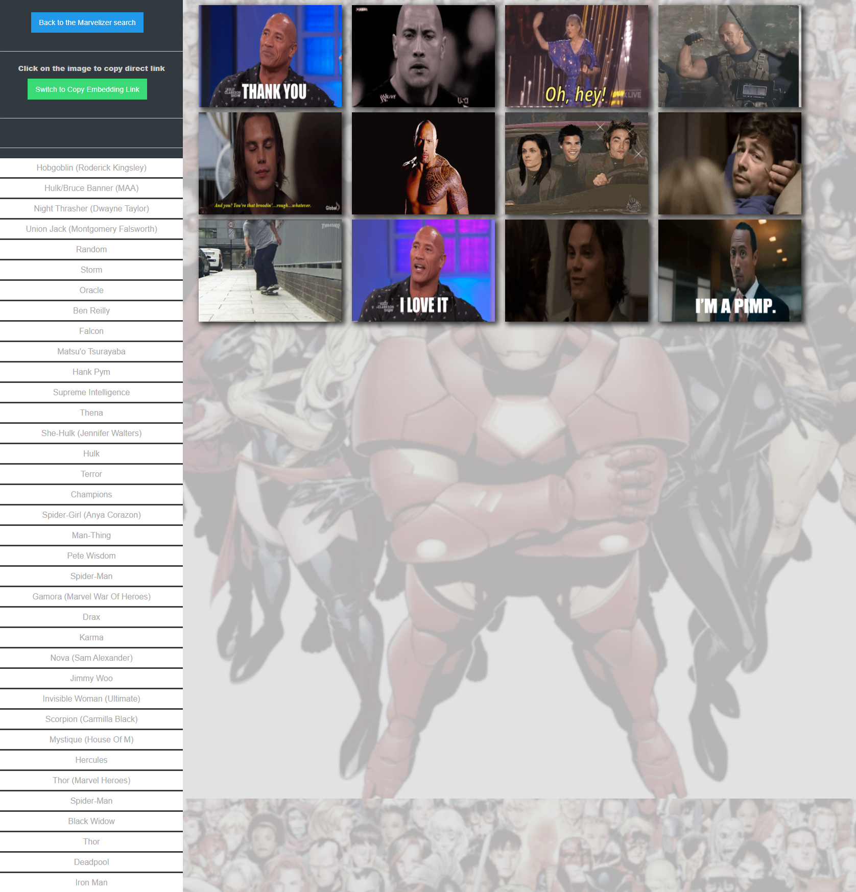

## Project MARVELizer

The MARVELizer is a web app that enables you to search for a Marvel character, view information and Giphys related to the character, and save favorite Giphys. The search feature queries the Marvel API for a character’s description and a thumbnail, and it uses the character name to query the Giphy API for the Giphys related to the character.

### Published site: [https://zoneam.github.io/Marvelizer/](https://zoneam.github.io/Marvelizer/)

User story:
AS A Marvel enthusiast,
I WANT to get information and Giphys for Marvel characters
SO THAT I can read about Marvel characters and collect my favorite Giphys of that character.

Technologies used:

- Foundation
- APIs (Marvel and Giphy)
- JQuery, JavaScript, HTML, and CSS
- local storage
- Git and GitHub

This was our first group assignment, and gave the team more experience developing with third-party APIs, as well as significantly more experience developing web apps as a team.

All team members contributed to ideas, researched APIs, and contributed to shared-screen development sessions. Additionally, individual contributions include

- Hayk Mnatsakanyan - Created GitHub repo and handled pull requests, lead shared-screen development sessions, was largely responsible for the search page and API calls, and more.
- Beau Barrier - Did Foundation component/template research and development, created the Favorites page, added background images and other visual design improvements. Wrote code for getting and saving GIF URL's to embed in user's web pages.
- Gerome Guevarra - Researched APIs, contributed ideas for general concept, contributed to shard-screen development sessions.
- Matt Linder - Researched APIs, contributed to concept, did Foundation component research and development, created slides for presentation, wrote readme, wrote first version of favorites-saving code, reworked Favorites page.

Challenges: Foundation components frequently had issues, we were concurrently developing weather dashboard apps (homework), we had to familiarize ourselves with some Git workflows related to team development, and we had to divide up the work and write code that worked with other team members' code.

Successes: We met the requirements (a working app that queries two APIs), we learned to work better as a team, and we got more experience working with APIs and web development in general.

Directions for Future Development:

- Enable users to remove items from favorites
- Display more information from API
- When favorite Giphys are saved for a character, these should be added to the set of Giphys previously saved for the character (not overwrite them)

Other links:

- [Marvel Developer Portal (API site)](https://developer.marvel.com/)
- [Giphy API site](https://developers.giphy.com/docs/api)
- [Foundation site (ZURB foundation)](https://get.foundation/)

---

---

